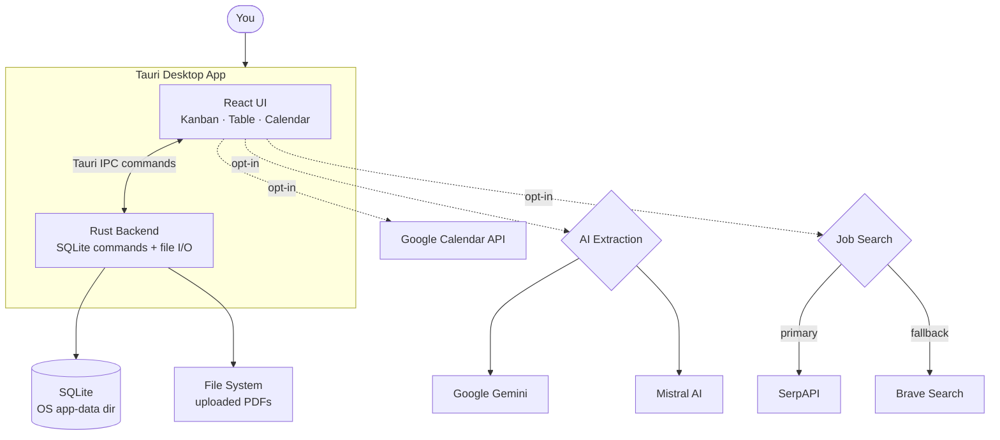
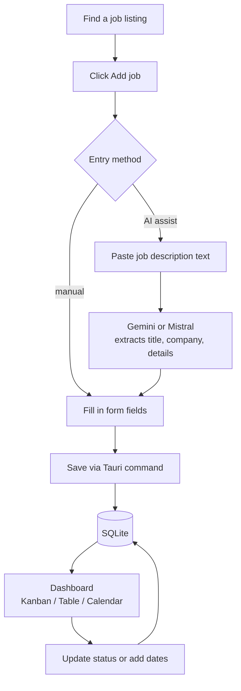
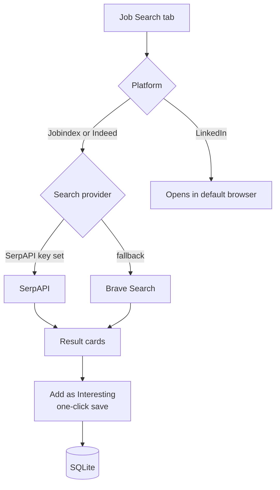
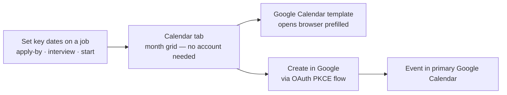

# Architecture

How Job Tracker is structured — what runs where, how data flows, and how features connect.

---

## Overview

Job Tracker is a **local-first desktop app** built with [Tauri](https://tauri.app/) (Rust shell + embedded WebView) and React/TypeScript. Everything — jobs, uploaded PDFs, status history — is stored on your machine. External calls only happen when you opt in with an API key.



---

## Data flows

### Adding and tracking a job



### Job search and import



### Calendar and scheduling



---

## Rust backend

The Rust process runs inside Tauri and handles all persistence. The React UI calls it via Tauri IPC commands — no HTTP server involved.

| Responsibility | Notes |
|---|---|
| SQLite CRUD | Jobs, status history, file metadata via [rusqlite](https://github.com/rusqlite/rusqlite) |
| DB migrations | Applied automatically on first run |
| File storage | Uploaded PDFs stored in the OS app-data directory |
| Indexes | Added for common sort and filter patterns |
| Transactions | Bulk imports and status + history writes are wrapped in a transaction |
| OS credential store | Google OAuth refresh token stored via OS APIs (Secret Service / Keychain / Credential Manager) |

---

## Frontend (React + TypeScript)

| Directory | Contents |
|---|---|
| `src/pages/` | Route-level views: Dashboard, AddJob, JobDetail, JobSearch, Settings, Calendar |
| `src/features/` | Feature modules — Kanban, Calendar, Job Search, Google Calendar integration |
| `src/components/` | Shared UI components |
| `src/context/` | App-wide React context (job data, settings) |
| `src/hooks/` | Custom React hooks |
| `src/lib/` | Utility functions and Tauri command wrappers |
| `src/i18n/` | Internationalisation strings |

The UI runs inside Tauri's embedded WebView. In development, Vite serves it with hot reload (`npm run tauri:dev`). Production builds bundle it into the binary.

---

## Optional integrations

All integrations are opt-in — the app is fully functional without any API key.

| Integration | Purpose | Where to configure |
|---|---|---|
| Google Gemini | AI extraction of job details from pasted text | Settings → AI Extraction |
| Mistral AI | Alternative AI extraction provider | Settings → AI Extraction |
| SerpAPI | Job search results for Jobindex and Indeed | Settings → Job Search |
| Brave Search | Job search fallback when SerpAPI has no results | Settings → Job Search |
| Google Calendar | Create calendar events for deadlines and interviews | Settings → Connect with Google |

---

## Storage locations

| Data | Location |
|---|---|
| SQLite database | OS app-data directory (managed by Tauri) |
| Uploaded PDFs | OS app-data directory — `files/` subdirectory |
| API keys (Gemini, Mistral, SerpAPI, Brave) | Browser local storage in the WebView profile |
| Google OAuth refresh token | OS credential store (Secret Service on Linux, Keychain on macOS, Credential Manager on Windows) |

The repo `storage/` folder is for optional manual files and is gitignored.

---

## Testing

Three independent CI workflows match three independent test suites:

| Workflow | Checks |
|---|---|
| **Frontend** | ESLint → Vitest → Vite build |
| **Rust** | `cargo clippy` → `cargo test` |
| **Python** | `ruff` → `black --check` → `isort --check-only` → `pytest` |

Run locally:
```bash
# Frontend
npm run test

# Rust
cargo test --manifest-path src-tauri/Cargo.toml

# Python
npm run py:test
```
