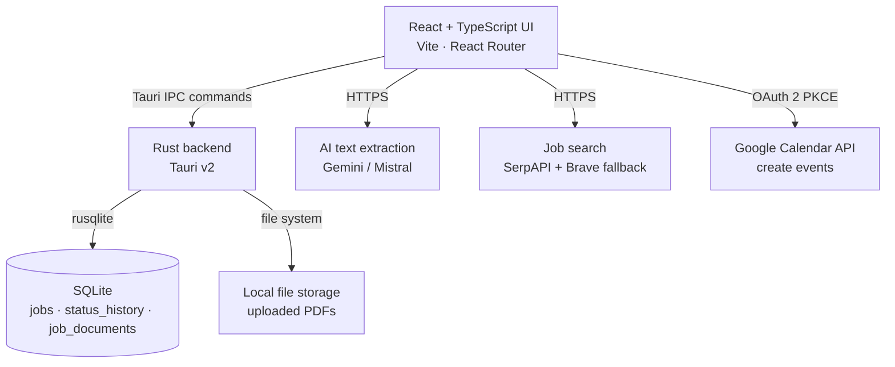
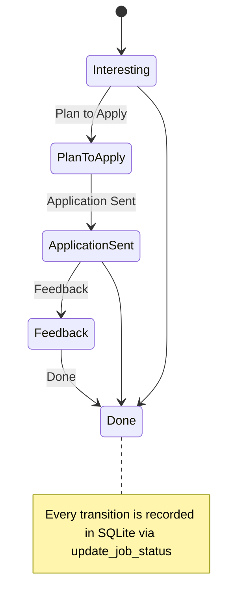
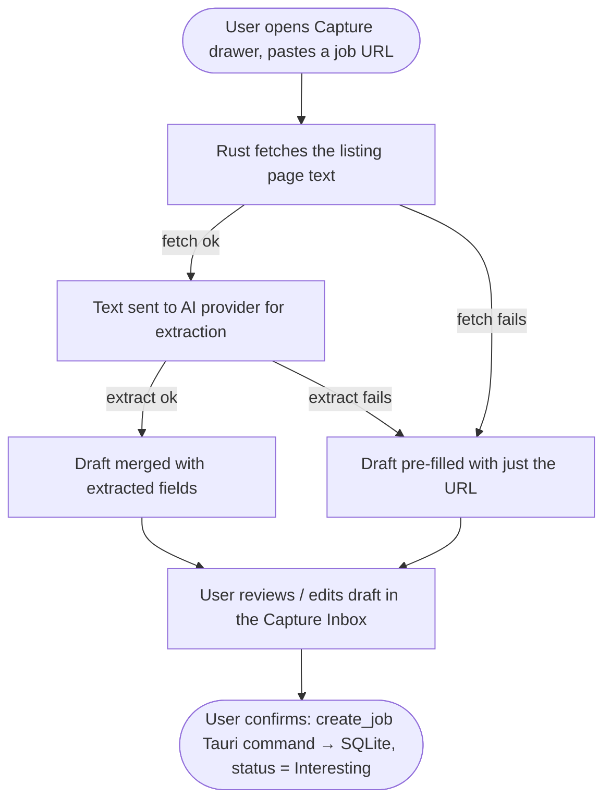
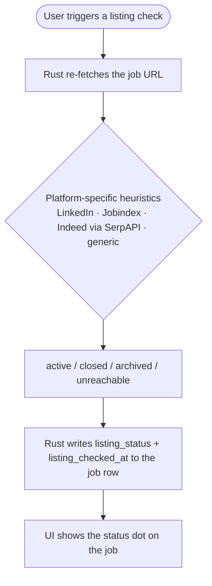
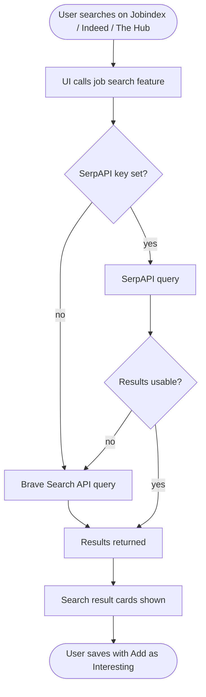
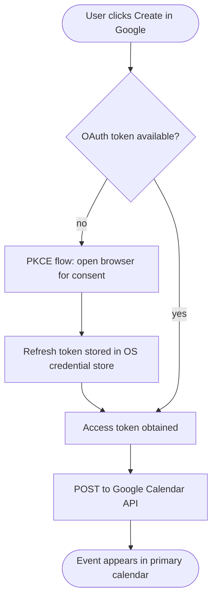

# Job Tracker — Architecture

This document describes how Job Tracker is built — from the desktop shell to the database, and how the optional AI and calendar integrations fit in.

---

## Overview

Job Tracker is a desktop application built with **Tauri v2** (Rust native shell) and a **React + TypeScript** UI. All data is stored locally: jobs, PDFs, and settings live in an OS-managed SQLite database and file directory — no cloud account required to use the core app.



---

## Tech Stack

| Layer | Technology |
|---|---|
| UI framework | React 19 + TypeScript + Vite |
| Routing | React Router v7 |
| Desktop shell | Tauri v2 (Rust) |
| Database | SQLite via rusqlite |
| Drag-and-drop | dnd-kit |
| AI extraction | Google Gemini / Mistral (user-supplied key) |
| Job search | SerpAPI (primary) + Brave Search API (fallback) |
| Calendar | Google Calendar API (OAuth 2 PKCE, desktop flow) |
| Theme | "Breath" light/dark palette (KDE/Manjaro), OS-aware via `prefers-color-scheme`, togglable in the header |
| Testing | Vitest (frontend), cargo test (Rust), pytest (Python scripts) |
| Linting | ESLint, TypeScript, cargo clippy, Ruff, Black, isort |
| Theming | "Breath" light/dark theme (`src/lib/theme.ts`, `src/hooks/useTheme.ts`) |

---

## Source Structure

```
src/                    — React + TypeScript UI
  features/             — Feature-scoped modules
    capture/            — Paste-URL capture: fetch listing text, AI-extract, and triage in a Capture Inbox (+ browser handoff link)
    deadlines/          — Deadline tracking logic
    extraction/         — AI text extraction (Gemini / Mistral)
    jobSearch/          — Job search providers (SerpAPI, Brave)
    jobs/                — Core job CRUD and state
    reminders/           — Reminder support
  components/           — Shared UI components
  context/              — React context providers (global app state)
  hooks/                — Shared custom hooks (incl. useTheme — Breath light/dark theme)
  i18n/                 — Internationalisation strings
  lib/                  — Utility functions (incl. theme.ts)
  pages/                — Route-level page components: Dashboard, Add Job, Job Detail (`/job/:id`), Job Search
src-tauri/              — Rust / Tauri backend
  src/                  — Tauri commands, SQLite access, file handling
  capabilities/         — Tauri permission declarations
docs/                   — Architecture and maintenance docs
scripts/                — Build and tooling scripts
tests/                  — Python integration tests (pytest)
storage/                — Optional manual file storage (gitignored)
```

---

## Key Data Flows

### Application status flow

Each job moves through a Kanban pipeline (columns are user-renameable in Settings; defaults shown). Every status change is written to a status-history table for the job's timeline view.



### Capture workflow (paste a URL)

Lets a user paste a job listing URL and get a pre-filled draft without manual data entry. Implemented in `src/features/capture/` and the `QuickCaptureDrawer`.



A URL can also be queued from outside the app via a copyable handoff link (`?capture_url=<url>`, e.g. from a browser bookmarklet). The **capture inbox** (`captureInbox.ts`) queues these client-side in browser `localStorage`; there is no Tauri/Rust backend command for it, so queued items do not sync across devices or survive a data wipe.

### Adding a job manually


### Listing status check

Lets a user re-check whether a saved posting is still live. Implemented in `src-tauri/src/listing_check.rs` and surfaced via `ListingStatusDot` in the job table, board, and detail timeline.



### AI-assisted extraction


### Job search



### Google Calendar event creation



---

## Data Storage

All data lives in the OS app data directory — nothing is stored in the repo.

| What | Where | Managed by |
|---|---|---|
| Jobs (incl. deadline, interview/start dates, notes, contact & workplace fields) | SQLite `jobs` table | Rust via rusqlite |
| Status change history | SQLite `status_history` table | Rust via rusqlite |
| Per-job document metadata (CV, cover letter, other) | SQLite `job_documents` table | Rust via rusqlite |
| Uploaded PDFs | OS file system | Rust file commands |
| API keys (AI, search) | Browser local storage | React UI |
| Theme preference | Browser local storage | React UI |
| Board column names (`statuses`) | Browser local storage | React UI |
| Capture inbox queue (browser handoff URLs) | Browser local storage | React UI |
| Google OAuth refresh token | OS credential store (keyring) | Tauri / OS keychain |
| Google OAuth Client ID | Plain file in OS app data dir (`google_oauth_client_id.txt`) | Rust |
| Backup copy (DB + PDFs) | User-chosen folder (Settings → Backup) | Rust `backup_to_folder`, run automatically after every change |

### SQLite tables

| Table | Purpose |
|---|---|
| `jobs` | One row per application — company, title, dates, contact, salary, status, etc. |
| `status_history` | Audit trail of `from_status` → `to_status` changes, written automatically on every status update |
| `job_documents` | One row per attached PDF (CV, cover letter, other), linked to a job |

---

## Dashboard Views

The **Dashboard** is the home screen and supports three view modes:

| View | Description |
|---|---|
| Kanban | Drag-and-drop columns by application status |
| Table | Sortable / filterable list of all jobs |
| Calendar | Month grid showing apply-by, interview, and start dates |

A **Reminders** panel (`ReminderCenter`) surfaces upcoming and overdue deadlines across all jobs, classed by urgency within a 14-day window.

### Status workflow

The default board pipeline (`DEFAULT_STATUSES` in `src/lib/types.ts`) is:

```
Interesting → Plan to Apply → Application Sent → Feedback → Done
```

This is a configurable default, not a fixed enum — column names can be renamed in Settings. Every status change is recorded in `status_history` with a timestamp and shown as a timeline on the job detail page.

### Job detail page

Each job has a dedicated page at `/job/:id` (`src/pages/JobDetailPage.tsx`) with the full edit form, per-job document upload/management, and the status-change timeline described above.

---

## CI

Three independent GitHub Actions workflows run on every push and pull request:

| Workflow | Checks |
|---|---|
| **Frontend** | ESLint → Vitest → `tsc -b && vite build` |
| **Rust** | `cargo clippy` → `cargo test` |
| **Python** | `ruff check` → `black --check` → `isort --check-only` → `pytest` |

A pre-commit hook (installed by `npm ci`) runs `npm run verify` locally before every commit so CI failures are caught early. Locally this uses **uv** to manage the Python environment (`pyproject.toml` / `uv.lock`); CI's `python.yml` instead installs from `requirements-dev.txt` via pip.
