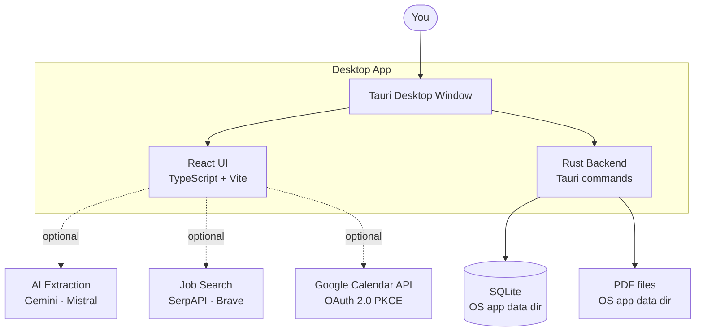
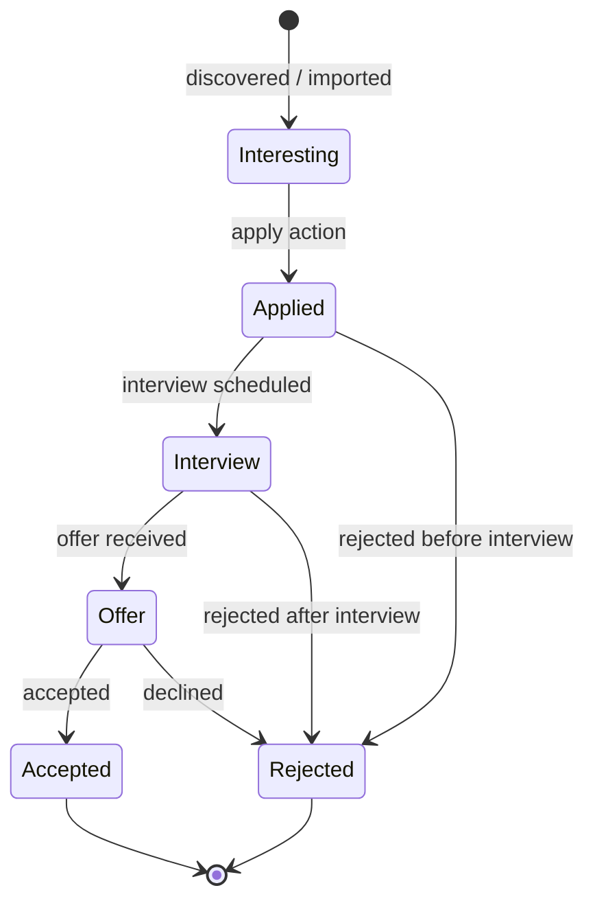
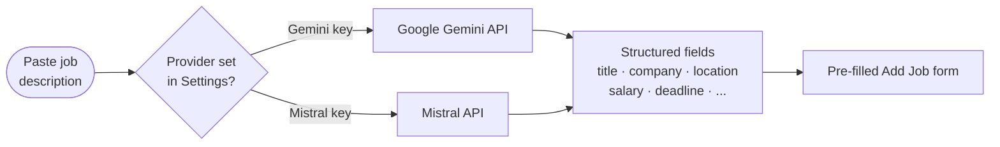
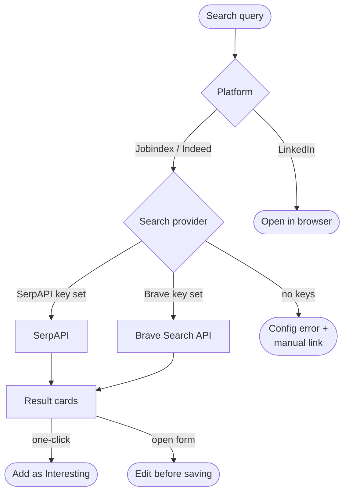
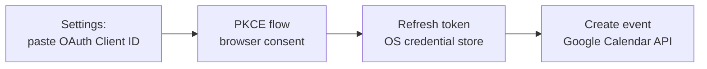

# Architecture

How Job Tracker is put together — from the desktop window down to SQLite.

---

## System overview

Job Tracker is a **fully local** desktop app. There is no server, no cloud account required, and all data stays on your machine.



The React UI communicates with the Rust backend exclusively through Tauri's `invoke()` IPC bridge — there is no HTTP server running.

---

## Layer overview

| Layer | Technology | Responsibility |
|-------|-----------|---------------|
| Desktop shell | Tauri 2 (Rust) | Native window, OS integration, IPC bridge |
| UI | React + TypeScript + Vite | All screens, routing, state management |
| Backend | Rust (rusqlite) | SQLite queries, file I/O, system commands |
| Storage | SQLite | Job records, status history, deadlines, reminders |
| File storage | OS app data dir | Uploaded application PDFs |

---

## Source layout

```
src/                    — React frontend (TypeScript)
  features/
    jobs/               — Job CRUD and state
    capture/            — Quick-add / job capture
    extraction/         — AI-assisted field extraction
    jobSearch/          — Job search integration
    deadlines/          — Deadline tracking
    reminders/          — Reminder logic
  pages/                — Page components (Dashboard, AddJob, JobDetail, JobSearch)
  components/           — Shared UI components
  hooks/                — Custom React hooks
  context/              — React context providers
  i18n/                 — Internationalisation strings
  lib/                  — Shared utilities
src-tauri/              — Rust backend (Tauri)
  src/                  — Tauri commands, SQLite queries, file helpers
  tauri.conf.json       — App metadata, bundle config, permissions
docs/                   — Project documentation
```

---

## Job lifecycle



Each status change is written to a history log in SQLite, so the full timeline of an application is preserved.

---

## AI extraction flow

Paste job description text and AI parses it into pre-filled form fields.



API keys are stored in the browser's local storage for the app profile. Extraction calls go directly from the React UI to the provider — the Rust backend is not involved.

---

## Job search flow



---

## Google Calendar integration

The Calendar tab shows job dates (apply-by, interview, start) from SQLite — no Google account is needed for the local month view. The Google integration is only required to push events to your own calendar.



---

## Storage locations

All data lives in the OS application data directory — nothing is stored in the repo.

| Location | Contents |
|----------|----------|
| `{os_data_dir}/com.jobtracker.app/jobs.db` | SQLite: jobs, history, deadlines, reminders |
| `{os_data_dir}/com.jobtracker.app/files/` | Uploaded application PDFs |

---

## CI

Three independent GitHub Actions workflows run on every push:

| Workflow | Checks |
|----------|--------|
| **Frontend** | ESLint → Vitest → Vite build |
| **Rust** | `cargo clippy` → `cargo test` |
| **Python** | ruff · black · isort → pytest |
