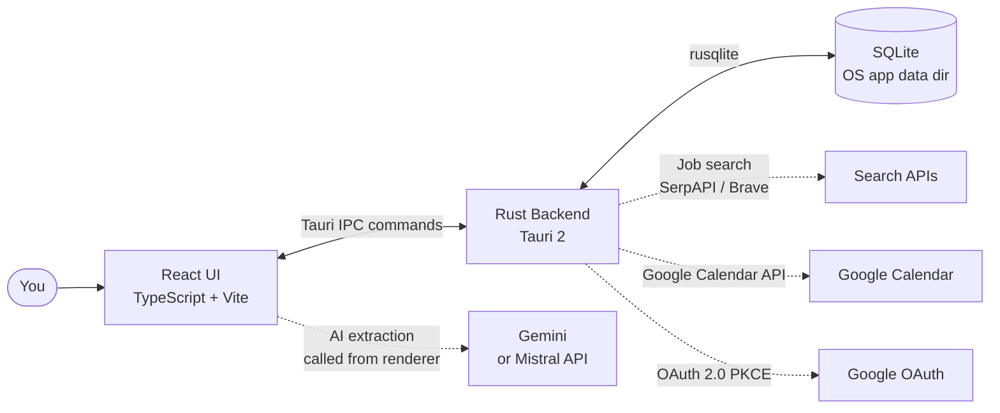
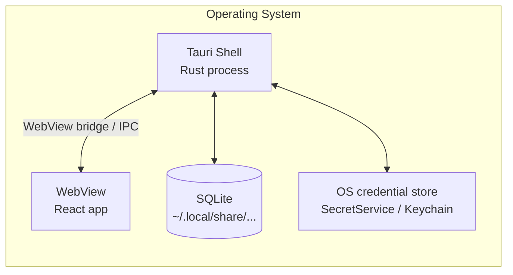
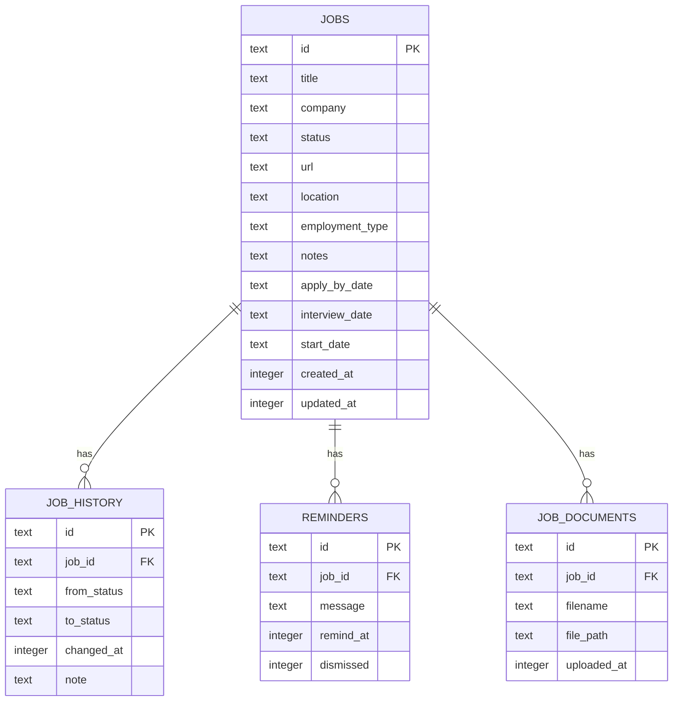
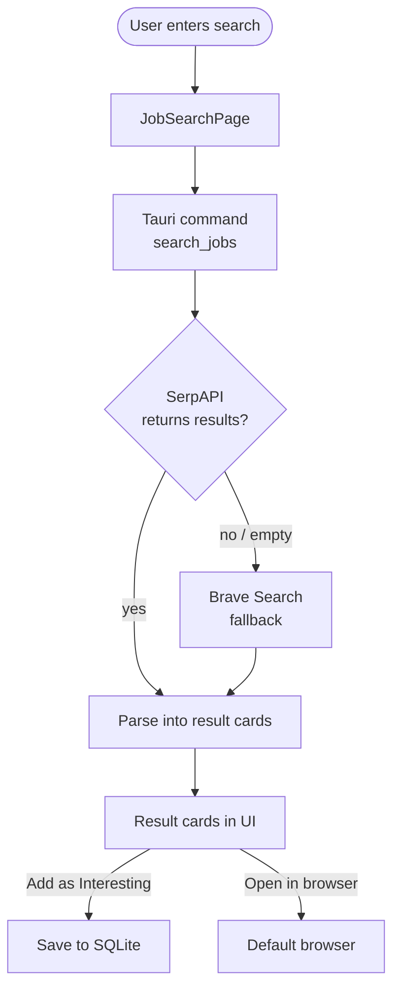
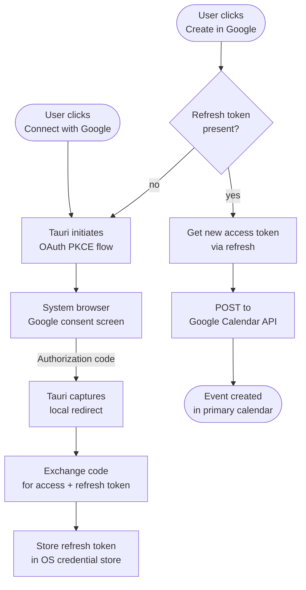

# Job Tracker — Architecture

This document covers how the app is built: the Tauri process model, the Rust command layer, SQLite data model, React feature structure, and external integrations.

---

## System overview

Job Tracker is a desktop app. The React UI runs inside a Tauri WebView and communicates with a Rust backend via Tauri's type-safe IPC commands. All persistent data lives in SQLite on your machine.

The UI never reads from or writes to SQLite directly — all persistence goes through Rust IPC commands. AI extraction calls are made from the renderer directly to the LLM API (keys are stored in browser local storage, scoped to the app WebView).

---

## Process model

- The Tauri shell owns the SQLite connection (one connection per process, WAL mode).
- The Google OAuth refresh token is stored in the OS credential store — never in SQLite or the filesystem.
- API keys for AI providers are stored in browser local storage, scoped to the app WebView profile.

---

## Rust command layer (`src-tauri/src/`)

| File | Responsibility |
|------|---------------|
| `lib.rs` | Tauri app setup — registers all IPC commands, opens the DB connection, runs migrations |
| `db.rs` | All SQLite operations — CRUD for jobs, history, reminders, documents, tags |
| `job_search.rs` | Job search against SerpAPI and Brave Search; parses results into typed structs |
| `calendar.rs` | Google Calendar API calls — create, update, delete events |
| `google_oauth.rs` | OAuth 2.0 PKCE flow, token refresh, and OS credential store integration |

---

## Data model

All tables live in a single SQLite file in the OS app data directory.

---

## React feature modules (`src/features/`)

| Module | What it handles |
|--------|----------------|
| `jobs/` | Core job CRUD — list, add, edit, status transitions |
| `deadlines/` | Deadline dates (apply-by, interview, start) — reading and editing |
| `extraction/` | AI-assisted field extraction (Gemini / Mistral) |
| `jobSearch/` | Job search UI and result handling |
| `capture/` | Quick-capture flow for saving a job directly from search results |
| `reminders/` | Reminder display and dismissal |

Pages in `src/pages/`:

| Page | Route | Purpose |
|------|-------|---------|
| `DashboardPage` | `/` | Kanban / Table / Calendar view of all jobs |
| `AddJobPage` | `/add` | Form to add a new job manually |
| `JobDetailPage` | `/jobs/:id` | Full detail view — edit, history, documents, reminders |
| `JobSearchPage` | `/search` | In-app job search across platforms |

---

## Job search flow

LinkedIn always opens in the browser — no API integration. Jobindex and Indeed use the provider-based search path above.

---

## Google Calendar flow

Scope: `https://www.googleapis.com/auth/calendar.events` (create events in the primary calendar only). No Client Secret is required — the PKCE flow is safe for native desktop apps.

---

## Adding a feature

1. Create a directory under `src/features/<name>/` with your components, hooks, and types.
2. For any data that needs to persist, add a Rust command in `src-tauri/src/db.rs` and register it in `lib.rs`.
3. If the feature needs a full-page view, add a page component to `src/pages/` and a route entry in `src/App.tsx`.
4. Update `docs/architecture.md` if the feature adds a new external integration or changes the data model.
