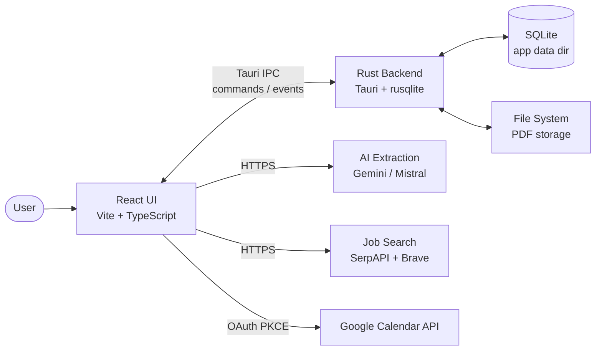
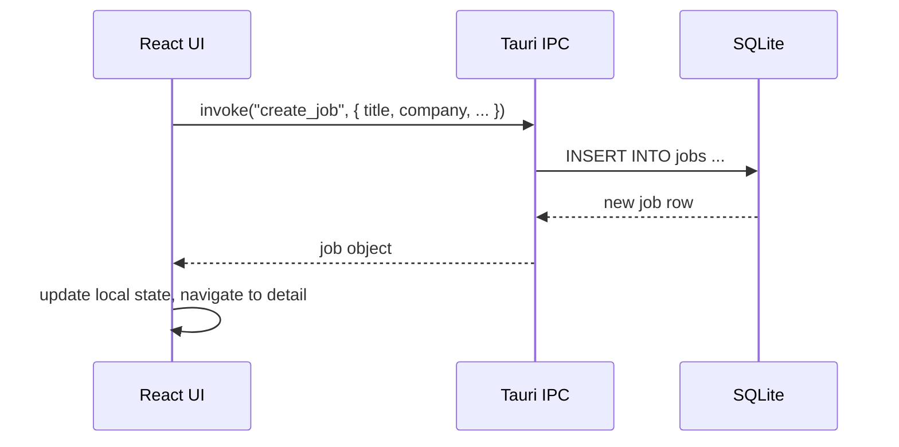
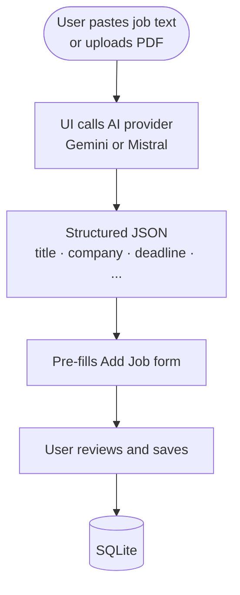
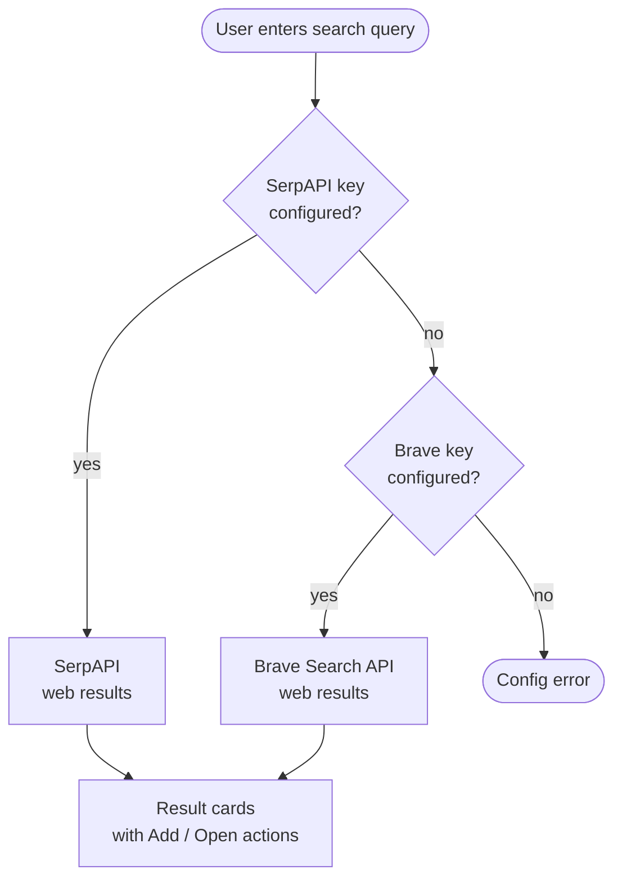
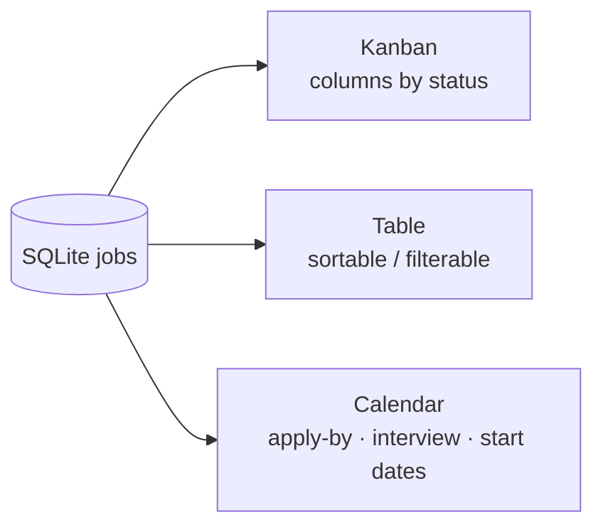
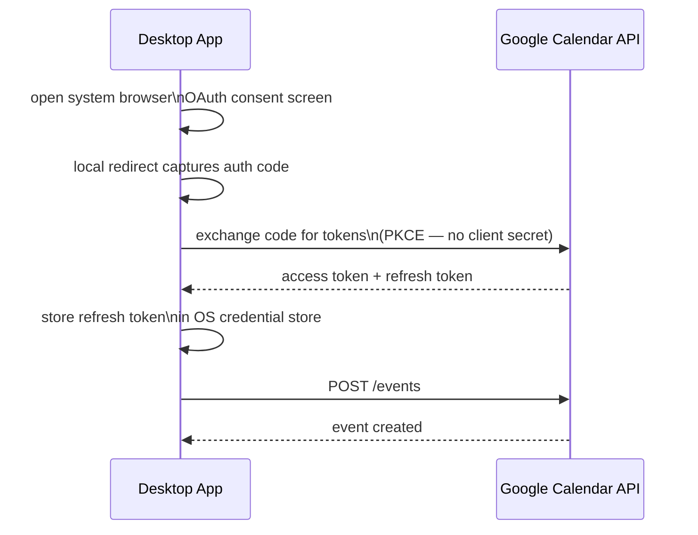
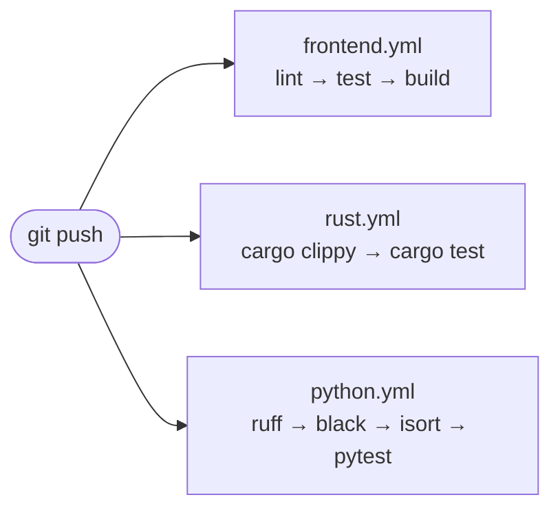

# Job Tracker Architecture

## Overview

Job Tracker is a local-first desktop application. All data lives on the user's machine in a SQLite database. There is no server and no cloud dependency by default — the only optional network calls are AI extraction and job search.



---

## Source structure

```
src/                  — React frontend (TypeScript)
├── components/       — Shared UI components
├── features/         — Feature modules (dashboard, job-detail, search, calendar, settings)
├── pages/            — Top-level route pages
├── hooks/            — Custom React hooks
├── context/          — App-wide React context (jobs, settings, auth)
├── lib/              — Utility functions and API wrappers
└── i18n/             — Internationalisation strings

src-tauri/            — Tauri Rust backend
├── src/
│   ├── main.rs       — Entry point
│   ├── commands/     — Tauri command handlers (CRUD, PDF, export, calendar)
│   ├── db/           — SQLite migrations and query helpers
│   └── storage/      — File path helpers and PDF management
└── tauri.conf.json   — App config (version, permissions, bundle targets)
```

---

## Data flows

### Adding or editing a job



### AI extraction from text or PDF



### Job search



---

## Dashboard views

The Dashboard renders the same SQLite data in three views:



---

## Google Calendar integration

Events are created via the Google Calendar API using a desktop OAuth PKCE flow. No client secret is stored.



---

## Storage

All data lives locally on the user's machine:

| Store | Location | Contents |
|-------|----------|----------|
| SQLite database | OS app data dir | Jobs, status history, notes, deadlines |
| PDF files | OS app data dir | Uploaded application PDFs |
| API keys | Browser local storage | Gemini / Mistral / SerpAPI / Brave keys |
| Google refresh token | OS credential store | Google Calendar OAuth token |
| Google Client ID | App settings | Configured by user in Settings |

The `storage/` folder in the repo is for optional manual files only; it is not used by the running app.

---

## Tech stack

| Layer | Technology |
|-------|------------|
| UI framework | React 19 + TypeScript |
| Build tool | Vite 8 |
| Routing | React Router v7 |
| Drag & drop | @dnd-kit/core |
| Desktop shell | Tauri 2 (Rust) |
| Database | SQLite via rusqlite |
| Testing — frontend | Vitest + Testing Library |
| Testing — Rust | cargo test |
| Linting | ESLint 9 · Ruff (Python) |
| Formatting | Black + isort (Python) |
| CI | GitHub Actions (3 workflows) |

---

## CI workflows

Three independent GitHub Actions workflows run on every push and pull request:



The Python workflow covers the `tests/` scripts (linting helpers and smoke tests), not a Python backend.
