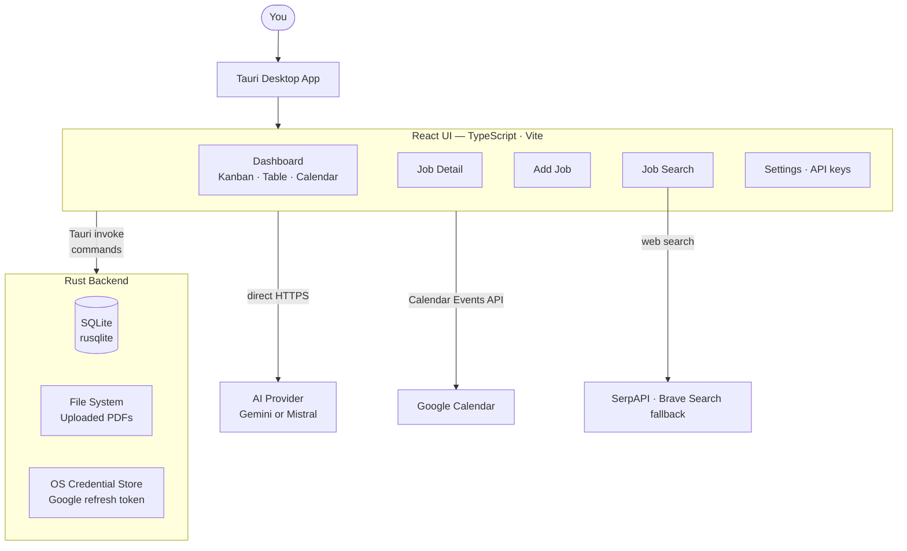
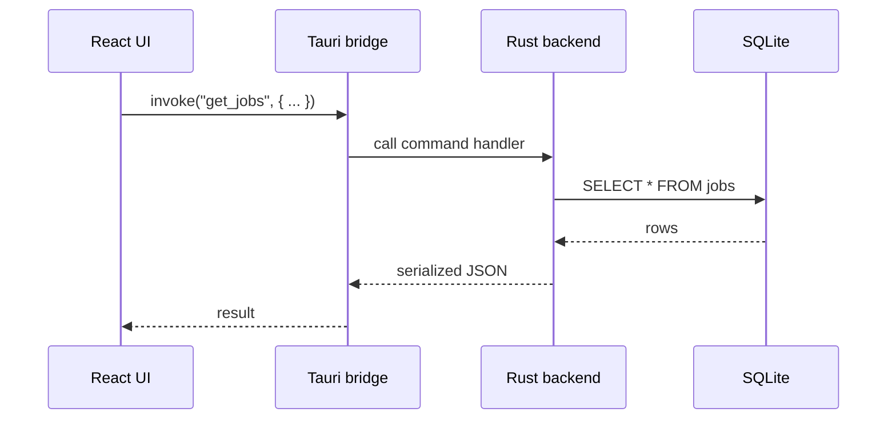
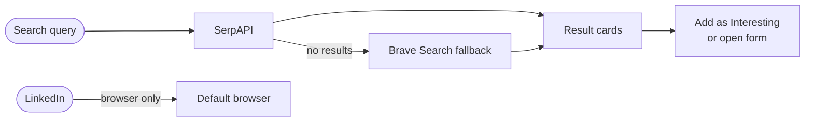
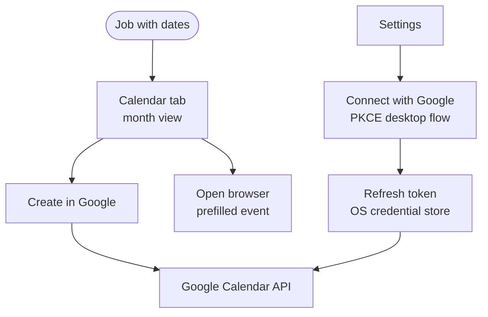

# Architecture

Job Tracker is a native desktop application built with Tauri 2. The UI runs in an embedded WebView (React + TypeScript) and communicates with a Rust backend through Tauri commands. All job data lives locally — no server or account required.

---

## System overview



---

## How Tauri commands work

The Rust backend exposes **Tauri commands** — functions callable from the JavaScript side via `invoke()`. All database reads/writes, file access, and OS-level operations go through this bridge.



External API calls — AI extraction, job search, Google Calendar — are made **directly from the frontend** via standard `fetch()`. Rust is not involved in those calls.

---

## Features

### Dashboard

The home screen with three view modes:

| Mode | Description |
|------|-------------|
| Kanban | Drag-and-drop cards grouped by application status |
| Table | Sortable list of all applications |
| Calendar | Month view highlighting apply-by, interview, and start dates |

Status columns are configurable in Settings.

### Job Detail

Full view for a single application. Fields include company, role, location, status, dates (apply-by, interview, start), salary, notes, and uploaded PDFs. Dates can optionally be pushed to Google Calendar.

### AI Extraction

Paste a job posting into the Add Job form and let an AI fill in the fields. Choose a provider in Settings:

- **Gemini** — Google AI Studio API key
- **Mistral** — La Plateforme API key (free Experiment tier is enough for occasional use)

API keys are stored in browser local storage for that app profile and are never sent through Rust.

### Job Search



- **Jobindex** and **Indeed** results arrive as cards you can save in one click.
- **LinkedIn** opens your default browser — no in-app API integration.
- Configure SerpAPI and/or Brave Search keys in Settings. If both are empty, search returns a configuration error but still shows an "Open in browser" option.

### Google Calendar



Requires a one-time Google Cloud setup — create a Desktop OAuth 2.0 client, paste the Client ID in Settings, and click **Connect with Google**. The app stores a refresh token in your OS credential store (Secret Service on Linux, Keychain on macOS, DPAPI on Windows). No Client Secret needed for the PKCE desktop flow.

Scope used: `https://www.googleapis.com/auth/calendar.events`.

### Import / Export

- **Export** — JSON or CSV from the app header
- **Import** — JSON (same shape as export) or CSV; creates new rows (original IDs are not preserved)

---

## Data model

All data lives in a local SQLite database managed by the Tauri app in the OS app data directory (e.g. `~/.local/share/app/` on Linux).

| Table | Contents |
|-------|----------|
| `jobs` | One row per application — company, role, status, dates, notes, salary |
| `pdfs` | References to uploaded PDF files stored alongside the database |

---

## Tech stack

| Layer | Technology |
|-------|------------|
| Desktop shell | Tauri 2 (Rust) |
| UI framework | React 19 + TypeScript |
| Build tool | Vite 8 |
| Routing | React Router 7 |
| Drag-and-drop | dnd-kit |
| Date handling | Day.js |
| Icons | Lucide React |
| Database | SQLite via rusqlite (Rust) |
| Frontend testing | Vitest + Testing Library |
| Rust testing | cargo test |
| Python tooling | pytest + ruff + black + isort |
| CI | GitHub Actions — three workflows |

---

## CI

Three independent GitHub Actions workflows run on every push and pull request:

| Workflow | What it runs |
|----------|--------------|
| **Frontend** | ESLint → Vitest → Vite build |
| **Rust** | cargo clippy → cargo test |
| **Python** | ruff + black + isort → pytest |

A pre-commit hook runs `npm run verify` (all three checks) before every local commit.

---

## Repository layout

```
src/                    — React/TypeScript frontend
  pages/                — DashboardPage, AddJobPage, JobDetailPage, JobSearchPage
  components/           — Shared UI components
  features/             — Feature-specific logic and components
  hooks/                — Custom React hooks
  context/              — React context providers
  i18n/                 — Internationalisation strings
src-tauri/              — Tauri + Rust backend
  src/                  — Rust command handlers and SQLite logic
  tauri.conf.json       — Tauri app configuration
tests/                  — Python integration tests
scripts/                — Build and install helpers
docs/                   — Documentation (you are here)
```
