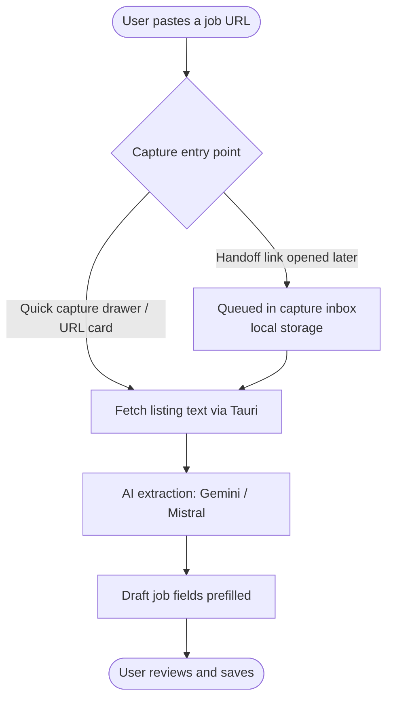
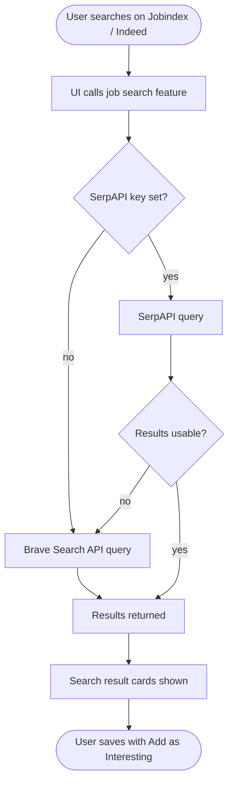

# Job Tracker — Architecture

This document describes how Job Tracker is built — from the desktop shell to the database, and how the optional AI and calendar integrations fit in.

---

## Overview

Job Tracker is a desktop application built with **Tauri v2** (Rust native shell) and a **React + TypeScript** UI. All data is stored locally: jobs, PDFs, and settings live in an OS-managed SQLite database and file directory — no cloud account required to use the core app.


---

## Tech Stack

| Layer | Technology |
|---|---|
| UI framework | React 19 + TypeScript + Vite |
| Routing | React Router v7 |
| Desktop shell | Tauri v2 (Rust) |
| Database | SQLite via rusqlite |
| Drag-and-drop | dnd-kit |
| AI extraction | Google Gemini / Mistral (user-supplied key) |
| Job search | SerpAPI (primary) + Brave Search API (fallback) |
| Calendar | Google Calendar API (OAuth 2 PKCE, desktop flow) |
| Testing | Vitest (frontend), cargo test (Rust), pytest (Python scripts) |
| Linting | ESLint, TypeScript, cargo clippy, Ruff, Black, isort |

---

## Source Structure

```
src/                    — React + TypeScript UI
  features/             — Feature-scoped modules
    capture/            — Quick-add job capture
    deadlines/          — Deadline tracking logic
    extraction/         — AI text extraction (Gemini / Mistral)
    jobSearch/          — Job search providers (SerpAPI, Brave)
    jobs/               — Core job CRUD and state
    reminders/          — Reminder support
  components/           — Shared UI components
  context/              — React context providers (global app state)
  hooks/                — Shared custom hooks
  i18n/                 — Internationalisation strings
  lib/                  — Utility functions
  pages/                — Route-level page components
src-tauri/              — Rust / Tauri backend
  src/                  — Tauri commands, SQLite access, file handling
  capabilities/         — Tauri permission declarations
docs/                   — Architecture and maintenance docs
scripts/                — Build and tooling scripts
tests/                  — Python integration tests (pytest)
storage/                — Optional manual file storage (gitignored)
```

---

## Key Data Flows

### Adding a job manually


### Quick capture (URL / drawer / inbox)



The **quick capture drawer** (`src/components/QuickCaptureDrawer.tsx`) also generates a shareable **handoff link** (`?capture_url=…`) — opening it later enqueues the URL into the **capture inbox** (`src/features/capture/captureInbox.ts`, browser local storage) for processing on the same pipeline via `CaptureInboxPanel`.

### AI-assisted extraction


### Job search



### Google Calendar event creation


---

## Data Storage

All data lives in the OS app data directory — nothing is stored in the repo.

| What | Where | Managed by |
|---|---|---|
| Jobs, deadlines, notes | SQLite database | Rust via rusqlite |
| Uploaded PDFs | OS file system | Rust file commands |
| API keys (AI, search) | Browser local storage | React UI |
| Google OAuth refresh token | OS credential store | Tauri / OS keychain |
| Board column names | SQLite | Rust |

---

## Dashboard Views

The **Dashboard** is the home screen and supports three view modes:

| View | Description |
|---|---|
| Kanban | Drag-and-drop columns by application status |
| Table | Sortable / filterable list of all jobs |
| Calendar | Month grid showing apply-by, interview, and start dates |

---

## CI

Three independent GitHub Actions workflows run on every push and pull request:

| Workflow | Checks |
|---|---|
| **Frontend** | ESLint → Vitest → `tsc -b && vite build` |
| **Rust** | `cargo clippy` → `cargo test` |
| **Python** | `ruff check` → `black --check` → `isort --check-only` → `pytest` |

A pre-commit hook (installed by `npm ci`) runs `npm run verify` locally before every commit so CI failures are caught early.
