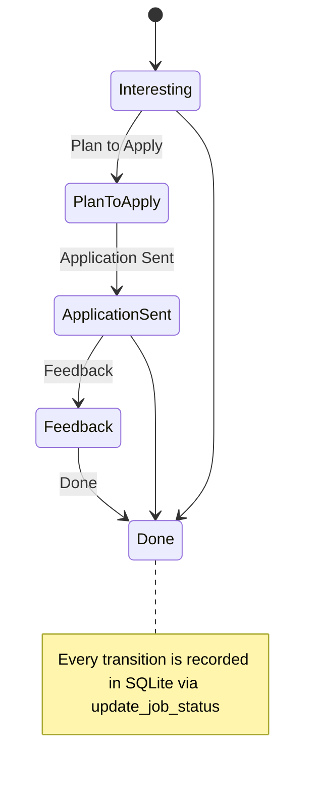
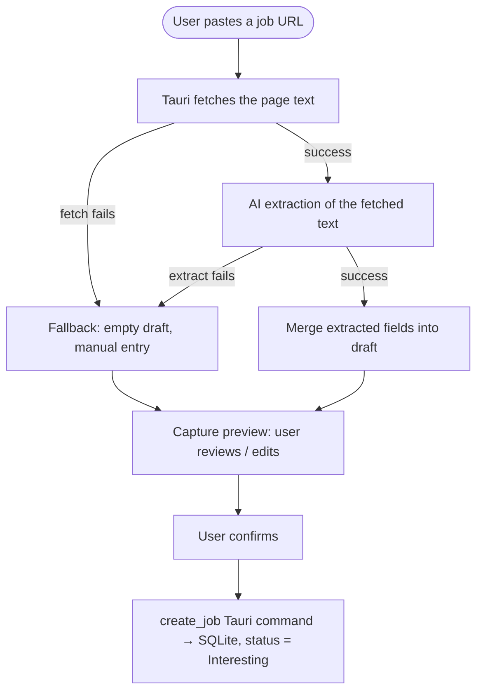
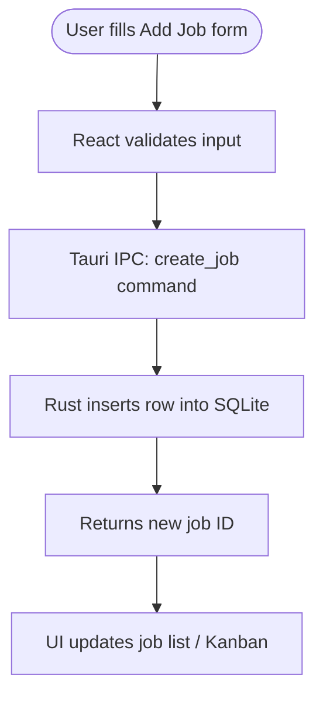
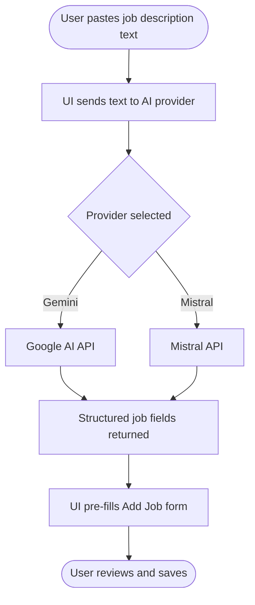

# Job Tracker — Architecture

This document describes how Job Tracker is built — from the desktop shell to the database, and how the optional AI and calendar integrations fit in.

---

## Overview

Job Tracker is a desktop application built with **Tauri v2** (Rust native shell) and a **React + TypeScript** UI. All data is stored locally: jobs, PDFs, and settings live in an OS-managed SQLite database and file directory — no cloud account required to use the core app.


---

## Tech Stack

| Layer | Technology |
|---|---|
| UI framework | React 19 + TypeScript + Vite |
| Routing | React Router v7 |
| Desktop shell | Tauri v2 (Rust) |
| Database | SQLite via rusqlite |
| Drag-and-drop | dnd-kit |
| AI extraction | Google Gemini / Mistral (user-supplied key) |
| Job search | SerpAPI (primary) + Brave Search API (fallback) |
| Calendar | Google Calendar API (OAuth 2 PKCE, desktop flow) |
| Testing | Vitest (frontend), cargo test (Rust), pytest (Python scripts) |
| Linting | ESLint, TypeScript, cargo clippy, Ruff, Black, isort |
| Theming | "Breath" light/dark theme (`src/lib/theme.ts`, `src/hooks/useTheme.ts`) |

---

## Source Structure

```
src/                    — React + TypeScript UI
  features/             — Feature-scoped modules
    capture/            — URL-paste capture pipeline + capture inbox (see Key Data Flows below)
    deadlines/          — Deadline tracking logic
    extraction/         — AI text extraction (Gemini / Mistral)
    jobSearch/          — Job search providers (SerpAPI, Brave)
    jobs/               — Core job CRUD, Kanban board, table, and status timeline
    reminders/          — Reminder support
  components/           — Shared UI components (incl. QuickCaptureDrawer)
  context/              — React context providers (global app state)
  hooks/                — Shared custom hooks (incl. useTheme — Breath light/dark theme)
  i18n/                 — Internationalisation strings
  lib/                  — Utility functions (incl. theme.ts)
  pages/                — Route-level page components: Dashboard, Add Job, Job Detail (`/job/:id`), Job Search
src-tauri/              — Rust / Tauri backend
  src/                  — Tauri commands, SQLite access, file handling
  capabilities/         — Tauri permission declarations
docs/                   — Architecture and maintenance docs
scripts/                — Build and tooling scripts
tests/                  — Python integration tests (pytest)
storage/                — Optional manual file storage (gitignored)
```

---

## Key Data Flows

### Application status flow

Each job moves through a Kanban pipeline (columns are user-renameable in Settings; defaults shown). Every status change is written to a status-history table for the job's timeline view.



### Capture workflow (paste a URL)

Lets a user paste a job listing URL and get a pre-filled draft without manual data entry. Implemented in `src/features/capture/` and the `QuickCaptureDrawer`.



The **capture inbox** (`captureInbox.ts`) queues browser-originated URLs client-side (browser `localStorage`); there is currently no Tauri/Rust backend command for it, so queued items do not sync across devices or survive a data wipe.

### Adding a job manually



### AI-assisted extraction



### Job search


### Google Calendar event creation


---

## Data Storage

All data lives in the OS app data directory — nothing is stored in the repo.

| What | Where | Managed by |
|---|---|---|
| Jobs, deadlines, notes | SQLite database | Rust via rusqlite |
| Uploaded PDFs | OS file system | Rust file commands |
| API keys (AI, search) | Browser local storage | React UI |
| Google OAuth refresh token | OS credential store | Tauri / OS keychain |
| Board column names | SQLite | Rust |

---

## Dashboard Views

The **Dashboard** is the home screen and supports three view modes:

| View | Description |
|---|---|
| Kanban | Drag-and-drop columns by application status |
| Table | Sortable / filterable list of all jobs |
| Calendar | Month grid showing apply-by, interview, and start dates |

Clicking a job opens its **Job Detail page** (`/job/:id`), which shows the full status timeline plus contact, workplace, and compensation fields (contact name/email/phone, workplace address, work mode, salary range, contract type, priority, reference number) alongside the attached PDFs.

---

## CI

Three independent GitHub Actions workflows run on every push and pull request:

| Workflow | Checks |
|---|---|
| **Frontend** | ESLint → Vitest → `tsc -b && vite build` |
| **Rust** | `cargo clippy` → `cargo test` |
| **Python** | `ruff check` → `black --check` → `isort --check-only` → `pytest` |

A pre-commit hook (installed by `npm ci`) runs `npm run verify` locally before every commit so CI failures are caught early.
