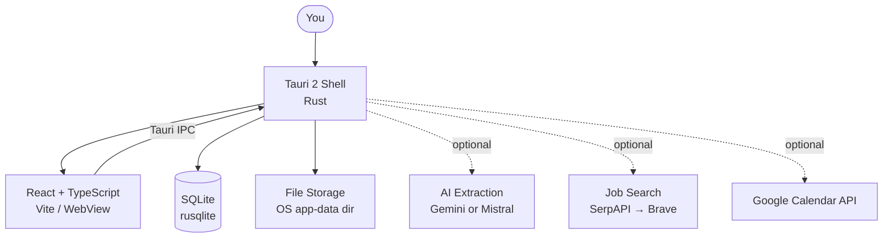
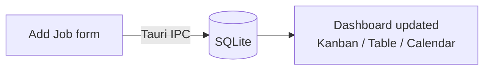
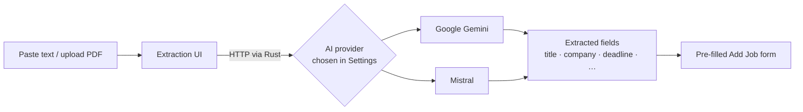
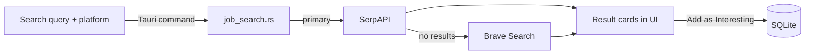
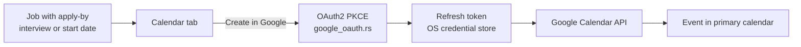

# Architecture

This document describes how Job Tracker is structured — from the desktop shell to data storage and external integrations.

---

## Overview

Job Tracker is a **Tauri 2** desktop application: a Rust native shell wraps a React + TypeScript web UI. All core data stays local — jobs, history, and uploaded PDFs are stored on your machine. External services (AI extraction, job search, Google Calendar) are optional and configured through Settings.

---

## Tech stack

| Layer | Technology |
|---|---|
| Desktop shell | Tauri 2 (Rust) |
| UI | React, TypeScript, Vite |
| Database | SQLite via rusqlite |
| Tests (frontend) | Vitest |
| Tests (Rust) | cargo test |
| Linting | ESLint, Ruff, Black, isort |

---

## Rust backend (`src-tauri/src/`)

All native operations run as Tauri commands in the Rust process. The frontend calls them via Tauri's typed IPC bridge.

| Module | What it does |
|---|---|
| `db.rs` | Job CRUD, history, reminders, migrations, bulk import/export |
| `job_search.rs` | Web search (SerpAPI primary, Brave Search fallback); result parsing per platform |
| `calendar.rs` | Build and submit Google Calendar events from job dates |
| `google_oauth.rs` | OAuth2 PKCE flow; stores refresh tokens in the OS credential store |
| `lib.rs` | Registers all Tauri commands and app startup |

---

## Frontend features (`src/features/`)

| Feature | What it does |
|---|---|
| `jobs/` | Job list, Kanban board, table view, calendar view, CRUD forms |
| `jobSearch/` | Search UI for Jobindex, Indeed (provider-based), LinkedIn (browser open) |
| `extraction/` | Paste text or upload PDF → AI fills in job fields |
| `capture/` | PDF/document upload and local storage |
| `deadlines/` | Deadline tracking and status indicators |
| `reminders/` | In-app reminder system for follow-ups |

---

## Data flows

### Adding a job manually

### AI-assisted extraction

Paste a job posting or upload a PDF. The AI reads the text and pre-fills the form fields.

### Job search

### Google Calendar

---

## Storage

All storage is local by default. No account is needed for the core tracker.

| Data | Where |
|---|---|
| Jobs, history, reminders | SQLite in OS app-data directory |
| Uploaded PDFs | OS app-data directory (path managed by Tauri) |
| AI and search API keys | Browser local storage (per app profile) |
| Google OAuth refresh token | OS credential store (Secret Service / Keychain / DPAPI) |

---

## External services

All optional — the app works without any of them.

| Service | Purpose | Configure in |
|---|---|---|
| Google Gemini | AI field extraction | Settings → AI |
| Mistral | AI field extraction | Settings → AI |
| SerpAPI | Job search results | Settings → Search |
| Brave Search | Job search fallback | Settings → Search |
| Google Calendar | Create events from job dates | Settings → Google Calendar |
