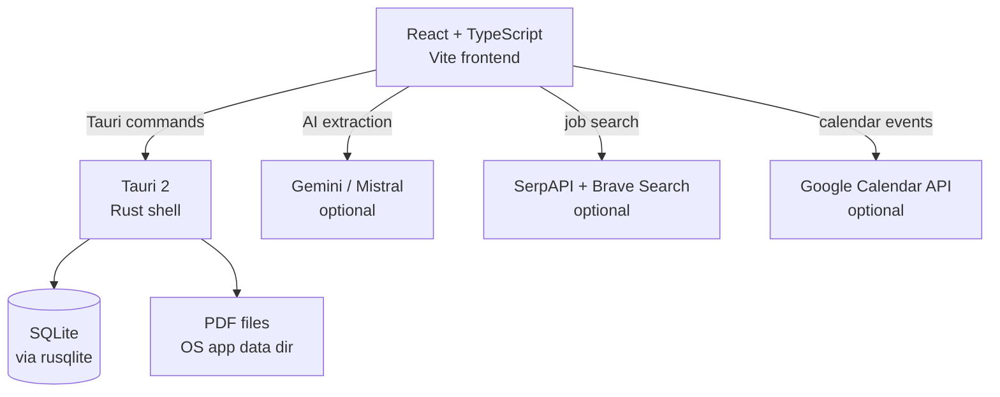
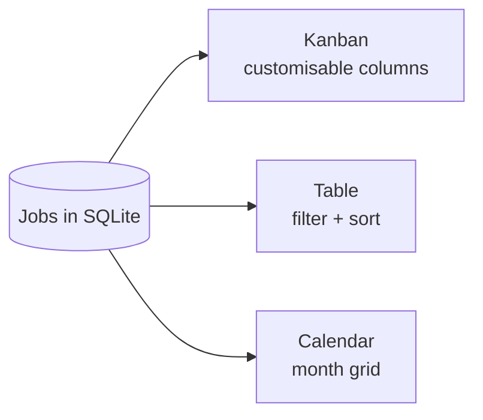
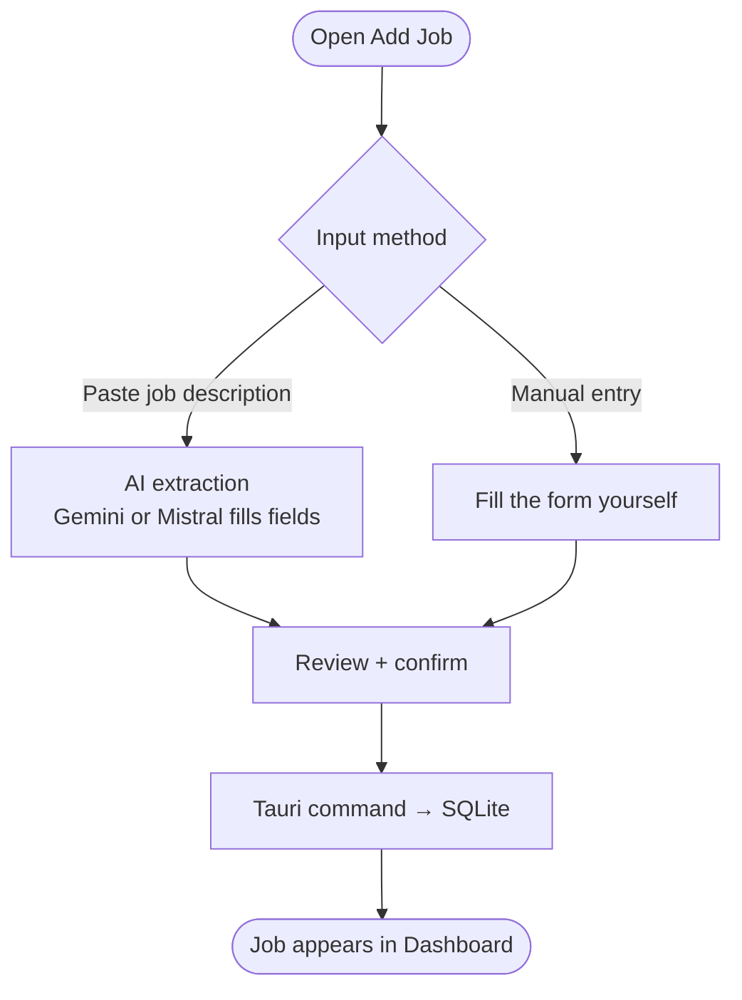
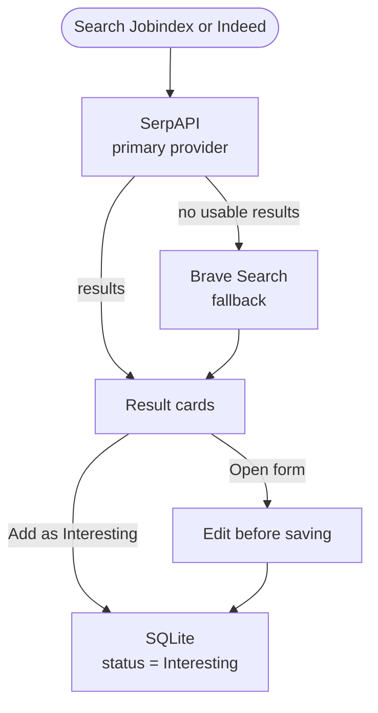
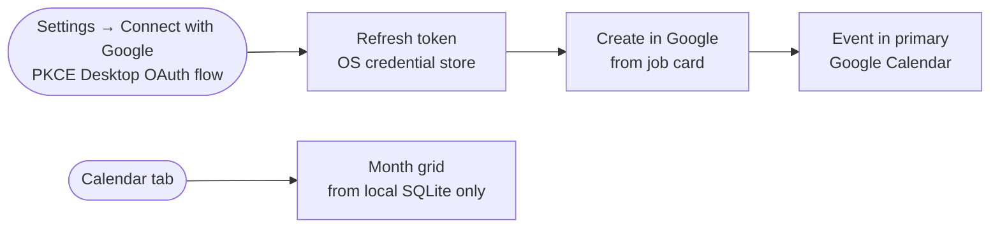
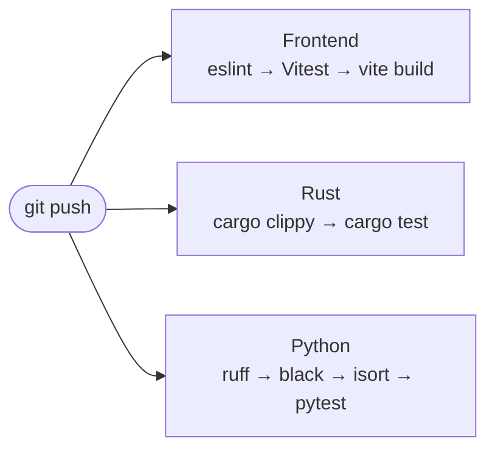

# Architecture

Job Tracker is a local-first desktop app — all data stays on your machine. This document describes how the pieces fit together.

---

## System overview



The React frontend communicates with the Rust backend exclusively through [Tauri commands](https://v2.tauri.app/develop/calling-rust/) — there is no HTTP server. All persistent data (jobs, notes, deadlines) lives in SQLite in the OS app data directory.

---

## Application layers

| Layer | Technology | Responsibility |
|---|---|---|
| UI | React 19 + TypeScript + Vite | All views: Dashboard, Add Job, Settings, Calendar, Job Search |
| Desktop shell | Tauri 2 (Rust) | Native window, file system access, SQLite, OS credential store |
| Storage | SQLite (rusqlite) | Job records, statuses, notes, history, dates |
| File storage | OS app data dir | Uploaded application PDFs |
| AI extraction | Gemini / Mistral | Extracts structured job data from pasted text (optional) |
| Job search | SerpAPI + Brave Search | Searches Jobindex and Indeed; LinkedIn is browser-only (optional) |
| Google Calendar | Google Calendar API | Creates calendar events for deadlines and interviews (optional) |

---

## Dashboard views

The Dashboard presents the same job data in three switchable views:



Board column names are configurable in Settings. The month calendar displays **apply-by**, **interview**, and **role start** dates from the local database — no Google account required to view the calendar.

---

## Adding a job



---

## Job search flow



LinkedIn is browser-only and opens in the system browser — no API key needed. If both SerpAPI and Brave Search keys are absent, search returns a configuration error; **Open in browser** still works.

---

## Google Calendar integration



No Client Secret is required — the app uses the PKCE flow for desktop apps. The refresh token is stored in the OS credential store (Secret Service on Linux, Keychain on macOS, Windows Credential Manager). Scope: `calendar.events`.

---

## Storage layout

| What | Where |
|---|---|
| Job database | OS app data directory |
| Uploaded PDFs | OS app data directory |
| API keys (Gemini, Mistral, SerpAPI, Brave) | App local storage |
| Google OAuth refresh token | OS credential store |

No data is sent to any server other than the external APIs you explicitly configure.

---

## CI and testing

Three independent workflows run on every push and pull request:



Run the same checks locally:

```bash
npm run verify            # all three
npm run verify:frontend   # lint + test + build
npm run verify:rust       # clippy + cargo test (requires GTK libs)
npm run verify:python     # ruff + black + isort + pytest
```

The pre-commit hook (installed by `npm ci`) runs `npm run verify` before every commit.
